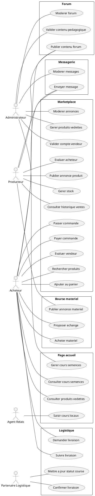

# Diagramme de Cas d'Utilisation — SmartAgriMarket V2

```plantuml
@startuml
left to right direction

actor "Producteur" as P
actor "Acheteur" as A
actor "Administrateur" as Admin
actor "Partenaire Logistique" as Log
actor "Agent Relais" as AR

rectangle "Marketplace" {
  P -- (Publier annonce produit)
  P -- (Gerer stock)
  P -- (Consulter historique ventes)
  A -- (Rechercher produits)
  A -- (Ajouter au panier)
  A -- (Passer commande)
  A -- (Payer commande)
  A -- (Evaluer vendeur)
  P -- (Evaluer acheteur)
  Admin -- (Valider compte vendeur)
  Admin -- (Moderer annonces)
  Admin -- (Gerer produits vedettes)
}

rectangle "Bourse materiel" {
  P -- (Publier annonce materiel)
  A -- (Proposer echange)
  A -- (Acheter materiel)
}

rectangle "Messagerie" {
  P -- (Envoyer message)
  A -- (Envoyer message)
  Admin -- (Moderer messages)
}

rectangle "Forum" {
  P -- (Publier contenu forum)
  A -- (Publier contenu forum)
  Admin -- (Valider contenu pedagogique)
  Admin -- (Moderer forum)
}

rectangle "Logistique" {
  A -- (Demander livraison)
  A -- (Suivre livraison)
  Log -- (Mettre a jour statut course)
  Log -- (Confirmer livraison)
}

rectangle "Page accueil" {
  A -- (Consulter produits vedettes)
  A -- (Consulter cours semences)
  AR -- (Saisir cours locaux)
  Admin -- (Gerer cours semences)
}

@enduml
```
