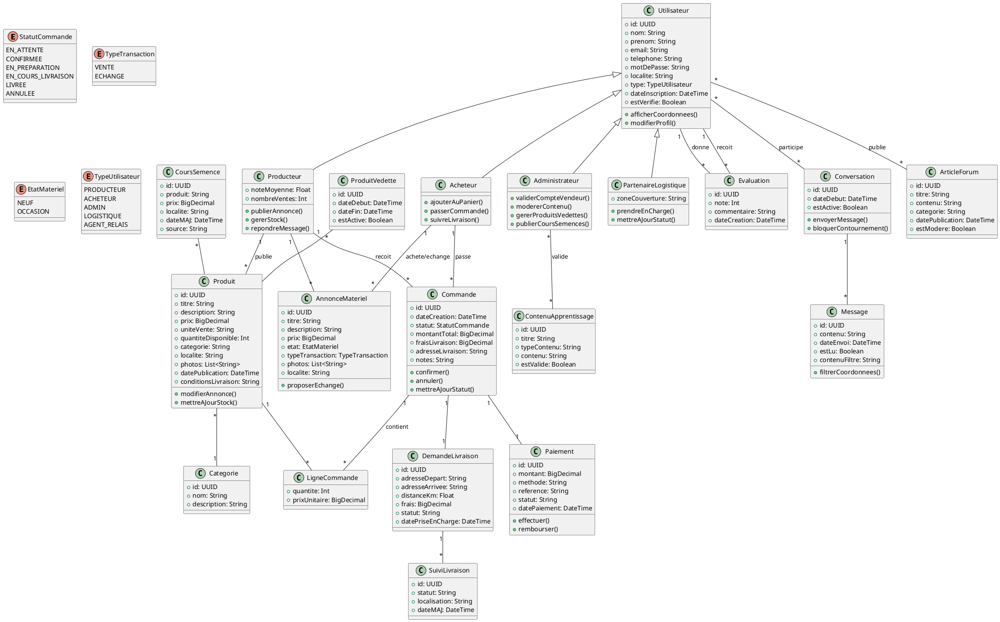

# Diagramme de Classes — SmartAgriMarket V2

```plantuml
@startuml

enum StatutCommande {
  EN_ATTENTE
  CONFIRMEE
  EN_PREPARATION
  EN_COURS_LIVRAISON
  LIVREE
  ANNULEE
}

enum TypeTransaction {
  VENTE
  ECHANGE
}

enum EtatMateriel {
  NEUF
  OCCASION
}

enum TypeUtilisateur {
  PRODUCTEUR
  ACHETEUR
  ADMIN
  LOGISTIQUE
  AGENT_RELAIS
}

class Utilisateur {
  +id: UUID
  +nom: String
  +prenom: String
  +email: String
  +telephone: String
  +motDePasse: String
  +localite: String
  +type: TypeUtilisateur
  +dateInscription: DateTime
  +estVerifie: Boolean
  +afficherCoordonnees()
  +modifierProfil()
}

class Producteur {
  +noteMoyenne: Float
  +nombreVentes: Int
  +publierAnnonce()
  +gererStock()
  +repondreMessage()
}

class Acheteur {
  +ajouterAuPanier()
  +passerCommande()
  +suivreLivraison()
}

class Administrateur {
  +validerCompteVendeur()
  +modererContenu()
  +gererProduitsVedettes()
  +publierCoursSemences()
}

class PartenaireLogistique {
  +zoneCouverture: String
  +prendreEnCharge()
  +mettreAJourStatut()
}

class Produit {
  +id: UUID
  +titre: String
  +description: String
  +prix: BigDecimal
  +uniteVente: String
  +quantiteDisponible: Int
  +categorie: String
  +localite: String
  +photos: List<String>
  +datePublication: DateTime
  +conditionsLivraison: String
  +modifierAnnonce()
  +mettreAJourStock()
}

class Categorie {
  +id: UUID
  +nom: String
  +description: String
}

class AnnonceMateriel {
  +id: UUID
  +titre: String
  +description: String
  +prix: BigDecimal
  +etat: EtatMateriel
  +typeTransaction: TypeTransaction
  +photos: List<String>
  +localite: String
  +proposerEchange()
}

class Commande {
  +id: UUID
  +dateCreation: DateTime
  +statut: StatutCommande
  +montantTotal: BigDecimal
  +fraisLivraison: BigDecimal
  +adresseLivraison: String
  +notes: String
  +confirmer()
  +annuler()
  +mettreAJourStatut()
}

class LigneCommande {
  +quantite: Int
  +prixUnitaire: BigDecimal
}

class Paiement {
  +id: UUID
  +montant: BigDecimal
  +methode: String
  +reference: String
  +statut: String
  +datePaiement: DateTime
  +effectuer()
  +rembourser()
}

class Evaluation {
  +id: UUID
  +note: Int
  +commentaire: String
  +dateCreation: DateTime
}

class Conversation {
  +id: UUID
  +dateDebut: DateTime
  +estActive: Boolean
  +envoyerMessage()
  +bloquerContournement()
}

class Message {
  +id: UUID
  +contenu: String
  +dateEnvoi: DateTime
  +estLu: Boolean
  +contenuFiltre: String
  +filtrerCoordonnees()
}

class DemandeLivraison {
  +id: UUID
  +adresseDepart: String
  +adresseArrivee: String
  +distanceKm: Float
  +frais: BigDecimal
  +statut: String
  +datePriseEnCharge: DateTime
}

class SuiviLivraison {
  +id: UUID
  +statut: String
  +localisation: String
  +dateMAJ: DateTime
}

class ArticleForum {
  +id: UUID
  +titre: String
  +contenu: String
  +categorie: String
  +datePublication: DateTime
  +estModere: Boolean
}

class ContenuApprentissage {
  +id: UUID
  +titre: String
  +typeContenu: String
  +contenu: String
  +estValide: Boolean
}

class CoursSemence {
  +id: UUID
  +produit: String
  +prix: BigDecimal
  +localite: String
  +dateMAJ: DateTime
  +source: String
}

class ProduitVedette {
  +id: UUID
  +dateDebut: DateTime
  +dateFin: DateTime
  +estActive: Boolean
}

' --- Associations ---

Utilisateur <|-- Producteur
Utilisateur <|-- Acheteur
Utilisateur <|-- Administrateur
Utilisateur <|-- PartenaireLogistique

Producteur "1" -- "*" Produit : publie
Acheteur "1" -- "*" Commande : passe
Producteur "1" -- "*" Commande : recoit
Commande "1" -- "*" LigneCommande : contient
Produit "1" -- "*" LigneCommande
Commande "1" -- "1" Paiement
Produit "*" -- "1" Categorie

Producteur "1" -- "*" AnnonceMateriel
Acheteur "1" -- "*" AnnonceMateriel : achete/echange

Utilisateur "1" -- "*" Evaluation : donne
Utilisateur "1" -- "*" Evaluation : recoit

Conversation "1" -- "*" Message
Utilisateur "*" -- "*" Conversation : participe

Commande "1" -- "1" DemandeLivraison
DemandeLivraison "1" -- "*" SuiviLivraison

CoursSemence "*" -- Produit
ProduitVedette "*" -- Produit

Utilisateur "*" -- "*" ArticleForum : publie
Administrateur "*" -- "*" ContenuApprentissage : valide

@enduml
```
