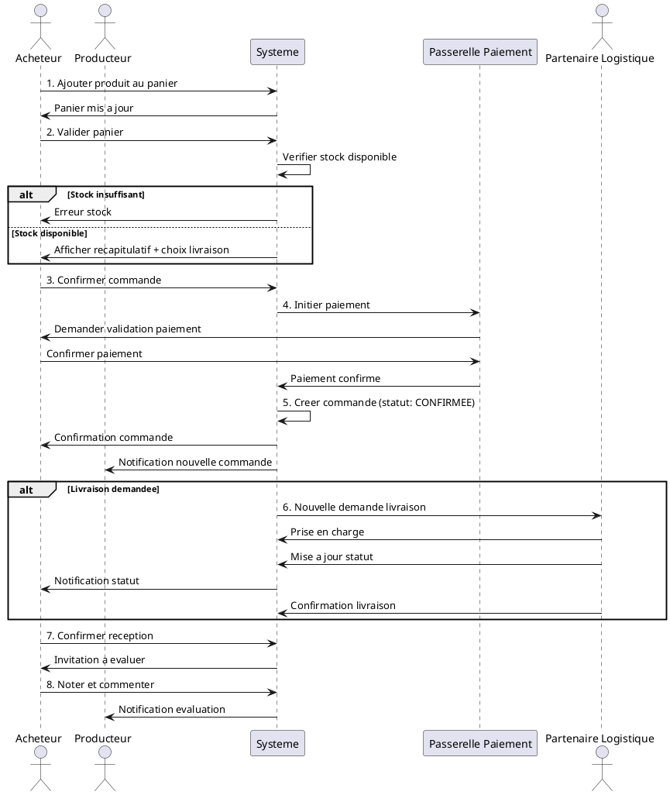

# Diagramme de Sequence — Passer une commande

```plantuml
@startuml
actor "Acheteur" as Acheteur
actor "Producteur" as Producteur
participant Systeme
participant Paiement as "Passerelle Paiement"
actor "Partenaire Logistique" as Log

Acheteur -> Systeme : 1. Ajouter produit au panier
Systeme -> Acheteur : Panier mis a jour

Acheteur -> Systeme : 2. Valider panier
Systeme -> Systeme : Verifier stock disponible
alt Stock insuffisant
  Systeme -> Acheteur : Erreur stock
else Stock disponible
  Systeme -> Acheteur : Afficher recapitulatif + choix livraison
end

Acheteur -> Systeme : 3. Confirmer commande

Systeme -> Paiement : 4. Initier paiement
Paiement -> Acheteur : Demander validation paiement
Acheteur -> Paiement : Confirmer paiement
Paiement -> Systeme : Paiement confirme

Systeme -> Systeme : 5. Creer commande (statut: CONFIRMEE)
Systeme -> Acheteur : Confirmation commande
Systeme -> Producteur : Notification nouvelle commande

alt Livraison demandee
  Systeme -> Log : 6. Nouvelle demande livraison
  Log -> Systeme : Prise en charge
  Log -> Systeme : Mise a jour statut
  Systeme -> Acheteur : Notification statut
  Log -> Systeme : Confirmation livraison
end

Acheteur -> Systeme : 7. Confirmer reception
Systeme -> Acheteur : Invitation a evaluer
Acheteur -> Systeme : 8. Noter et commenter
Systeme -> Producteur : Notification evaluation

@enduml
```
