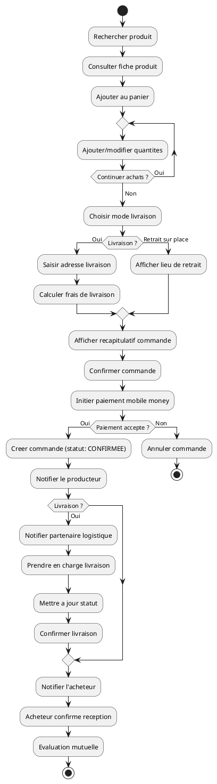

# Diagramme d'Activites — Processus de commande

```plantuml
@startuml
start
:Rechercher produit;
:Consulter fiche produit;
:Ajouter au panier;
repeat
  :Ajouter/modifier quantites;
repeat while (Continuer achats ?) is (Oui)
->Non;

:Choisir mode livraison;
if (Livraison ?) then (Oui)
  :Saisir adresse livraison;
  :Calculer frais de livraison;
else (Retrait sur place)
  :Afficher lieu de retrait;
endif

:Afficher recapitulatif commande;
:Confirmer commande;
:Initier paiement mobile money;
if (Paiement accepte ?) then (Oui)
  :Creer commande (statut: CONFIRMEE);
  :Notifier le producteur;
  if (Livraison ?) then (Oui)
    :Notifier partenaire logistique;
    :Prendre en charge livraison;
    :Mettre a jour statut;
    :Confirmer livraison;
  endif
  :Notifier l'acheteur;
  :Acheteur confirme reception;
  :Evaluation mutuelle;
  stop
else (Non)
  :Annuler commande;
  stop
endif

@enduml
```
