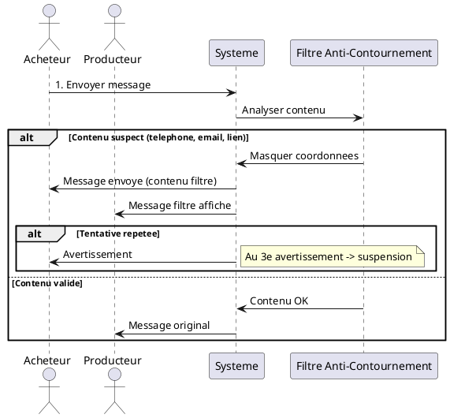

# Diagramme de Sequence — Messagerie anti-contournement

```plantuml
@startuml
actor "Acheteur" as Acheteur
actor "Producteur" as Producteur
participant Systeme
participant Filtre as "Filtre Anti-Contournement"

Acheteur -> Systeme : 1. Envoyer message
Systeme -> Filtre : Analyser contenu

alt Contenu suspect (telephone, email, lien)
  Filtre -> Systeme : Masquer coordonnees
  Systeme -> Acheteur : Message envoye (contenu filtre)
  Systeme -> Producteur : Message filtre affiche
  alt Tentative repetee
    Systeme -> Acheteur : Avertissement
    note right: Au 3e avertissement -> suspension
  end
else Contenu valide
  Filtre -> Systeme : Contenu OK
  Systeme -> Producteur : Message original
end

@enduml
```
