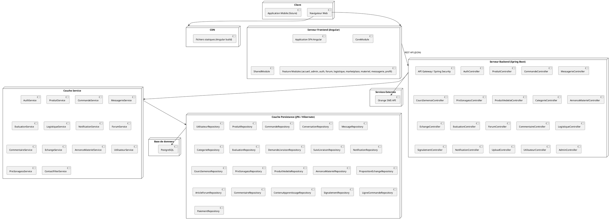

# Diagramme de Deploiement — Architecture Angular + Spring Boot

```plantuml
@startuml
node "Client" {
  [Navigateur Web]
  [Application Mobile (future)]
}

node "CDN" {
  [Fichiers statiques (Angular build)]
}

node "Serveur Frontend (Angular)" {
  [Application SPA Angular]
  [CoreModule]
  [SharedModule]
  [Feature Modules (accueil, admin, auth, forum, logistique, marketplace, materiel, messagerie, profil)]
}

node "Serveur Backend (Spring Boot)" {
  [API Gateway / Spring Security]
  [AuthController]
  [ProduitController]
  [CommandeController]
  [MessagerieController]
  [CoursSemenceController]
  [PrixSonagessController]
  [ProduitVedetteController]
  [CategorieController]
  [AnnonceMaterielController]
  [EchangeController]
  [EvaluationController]
  [ForumController]
  [CommentaireController]
  [LogistiqueController]
  [SignalementController]
  [NotificationController]
  [UploadController]
  [UtilisateurController]
  [AdminController]
}

node "Couche Service" {
  [AuthService]
  [ProduitService]
  [CommandeService]
  [MessagerieService]
  [EvaluationService]
  [LogistiqueService]
  [NotificationService]
  [ForumService]
  [CommentaireService]
  [EchangeService]
  [AnnonceMaterielService]
  [UtilisateurService]
  [PrixSonagessService]
  [ContactFilterService]
}

node "Couche Persistance (JPA / Hibernate)" {
  [UtilisateurRepository]
  [ProduitRepository]
  [CommandeRepository]
  [ConversationRepository]
  [MessageRepository]
  [CategorieRepository]
  [EvaluationRepository]
  [DemandeLivraisonRepository]
  [SuiviLivraisonRepository]
  [NotificationRepository]
  [CoursSemenceRepository]
  [PrixSonagessRepository]
  [ProduitVedetteRepository]
  [AnnonceMaterielRepository]
  [PropositionEchangeRepository]
  [ArticleForumRepository]
  [CommentaireRepository]
  [ContenuApprentissageRepository]
  [SignalementRepository]
  [LigneCommandeRepository]
  [PaiementRepository]
}

node "Base de donnees" {
  [PostgreSQL]
}

node "Services Externes" {
  [Orange SMS API]
}

[Navigateur Web] --> [CDN]
[Navigateur Web] --> [Serveur Frontend (Angular)]

[Serveur Frontend (Angular)] --> [Serveur Backend (Spring Boot)] : REST API (JSON)

[Serveur Backend (Spring Boot)] --> [Couche Service]
[Couche Service] --> [Couche Persistance (JPA / Hibernate)]

[Couche Persistance (JPA / Hibernate)] --> [PostgreSQL]

[Serveur Backend (Spring Boot)] --> [Orange SMS API]

@enduml
```
